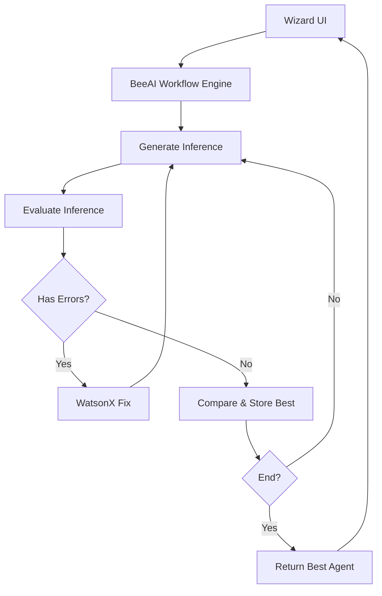

# 🤖 WatsonX Inference Matcher with BeeAI Framework

Generalized Agent Generation through Multi-Round Inference and Evaluation using LLMs and BeeAI Workflows.

## 📌 Project Overview

This project implements a robust **WatsonX Iterative Inference Matcher** using the **BeeAI framework**, enhanced with:

- Multi-step agent generation via iterative LLM inference
- Automatic evaluation and comparison logic
- Error recovery and auto-retry using WatsonX AI Debugger
- A Streamlit-based frontend wizard for guided agent creation

It is designed to **generalize agent generation** across diverse infrastructure templates and supports automated testing, correction, and optimization of code via AI feedback loops.

## ⚙️ Features

✅ Iterative generation via BeeAI Workflows  
✅ Prompt Templates for flexible prompt engineering  
✅ Target-based evaluation scoring  
✅ Auto-error fixing and retry using WatsonX  
✅ Streamlit wizard UI to collect agent specifications  
✅ Full modular Python backend with extensibility  

## 📁 Project Structure

```bash
.
├── src/
│   ├── workflows/
│   │   └── inference_matcher_workflow.py      # BeeAI workflow engine
│   ├── templates/
│   │   ├── inference_template.py              # Prompt template
│   │   └── agent_generation_template.py       # Specialized for agent configurations
│   ├── evaluation/
│   │   └── evaluation_utils.py                # Custom scoring logic
│   ├── config/
│   │   └── targets.json                       # Target criteria definitions
│   ├── examples/
│   │   └── sample_document.txt                # Example input template
│   ├── debugger/
│   │   ├── debugger_app.py                    # Streamlit app for error fixing
│   │   └── utils.py                           # WatsonX integration logic
│   ├── frontend/
│   │   └── wizard_app.py                      # Web wizard for agent creation
│   └── tests/
│       ├── test_inference_workflow.py         # Workflow test cases
│       └── test_evaluation.py                 # Evaluation tests
├── .env                                       # API credentials (not committed)
├── requirements.txt
├── README.md
└── docs/
    └── documentation.md                       # Architecture & design report
```

## 🧪 Installation & Setup Guide

### ✅ 1. Clone the Repository

```bash
git clone https://github.com/ruslanmv/watsonx-inference-matcher-beeai.git
cd watsonx-inference-matcher-beeai
```

### ✅ 2. Create and Activate Virtual Environment

```bash
python -m venv .venv
source .venv/bin/activate    # macOS/Linux
.venv\Scripts\activate       # Windows
```

### ✅ 3. Install Requirements

```bash
pip install -r requirements.txt
```

Ensure these core dependencies are installed:
- `beeai-framework`
- `streamlit`
- `pydantic`
- `ibm-watson-machine-learning`
- `ibm_watsonx_ai`
- `python-dotenv`

---

## 🔧 Model Setup

### WatsonX AI (IBM Cloud)

#### 1. Configure `.env`

```env
API_KEY=your_ibm_api_key
PROJECT_ID=your_project_id
URL=https://us-south.ml.cloud.ibm.com
```

#### 2. Client Example

```python
from ibm_watsonx_ai import APIClient, Credentials

credentials = Credentials(api_key="your_ibm_api_key", url="https://us-south.ml.cloud.ibm.com")
client = APIClient(credentials, project_id="your_project_id")
```

---

### Ollama

#### 1. Installation

- **macOS/Windows:**  
  Download and install the Ollama application from [ollama.com](https://ollama.com/download).

- **Linux:**  
  ```bash
  curl -fsSL https://ollama.com/install.sh | sh
  ```

- **Docker:**  
  ```bash
  docker pull ollama/ollama
  ```

#### 2. Running a Model

To run a model (e.g., Llama 3.2), execute:

```bash
ollama run llama3.2
```

#### 3. (Optional) Ollama Python Client

If you plan to integrate Ollama within your Python code:

```bash
pip install ollama-python
```

*For further details on both WatsonX AI and Ollama setup, please refer to the full README.md.*

---

## 🚀 Running the Project

### 🔁 Inference Matcher

```bash
python -m src.workflows.inference_matcher_workflow
```

### 🧙 Wizard UI

```bash
streamlit run src/frontend/wizard_app.py
```

- Paste document template  
- Select parameters  
- Paste target config  
- Click `Generate Agent`  
- 🎉 View best inference & score

### 🐞 Debugger (Auto Error Recovery)

```bash
streamlit run src/debugger/debugger_app.py
```

Paste buggy Python code, and the WatsonX AI Debug Assistant will:
- Detect issues
- Suggest fixes
- Retry with corrected code

---

## 🧪 Testing

```bash
pytest src/tests/
```

Covers:
- Workflow inference cycle
- Agent evaluation logic
- Code fix & retry logic

---

## 🧠 Sample Runner

```python
from src.workflows.inference_matcher_workflow import inference_workflow, InferenceMatcherState
import json, asyncio

async def run():
    state = InferenceMatcherState(
        document_template=open("src/examples/sample_document.txt").read(),
        target_output=json.load(open("src/config/targets.json")),
        search_parameters=["version=1", "version=2", "version=3"],
        max_iterations=3
    )
    result = await inference_workflow.run(state)
    print("Best Inference:\n", result.state.best_inference)

asyncio.run(run())
```

---

## 🎯 Advanced Configuration

| Parameter           | Description                                        |
|---------------------|----------------------------------------------------|
| `max_iterations`    | Max retry attempts for inference search            |
| `search_parameters` | List of variations used in prompt templates        |
| `target_output`     | Objective for best match, used in evaluation       |
| `output_format`     | Optionally enforce response format (e.g., JSON)    |

---

## 📚 Documentation

See `docs/documentation.md` for:
- Architecture & Mermaid diagram
- Prompt generation logic
- Scoring metrics (similarity, relevance)
- Agent generation lifecycle

---

## 🧰 Architecture



---

## ✅ Commands Summary

| Task                       | Command                                              |
|----------------------------|------------------------------------------------------|
| Clone repo                 | `git clone`                                          |
| Create virtual env         | `python -m venv .venv && source .venv/bin/activate`  |
| Install requirements       | `pip install -r requirements.txt`                   |
| Launch backend             | `python -m src.workflows.inference_matcher_workflow` |
| Start wizard UI            | `streamlit run src/frontend/wizard_app.py`           |
| Launch debugger assistant  | `streamlit run src/debugger/debugger_app.py`         |
| Run test suite             | `pytest src/tests/`                                  |

---

## 🛠️ Future Roadmap

- Agent simulation/testing with auto-validation
- Embedding-based output evaluation
- Custom scoring tools for domain-specific agents
- One-click export of generated agents

---

## 🤝 Contributing

We welcome:
- 🔧 Feature improvements
- 🐞 Bug fixes
- 📚 Documentation & testing

Fork the repo, branch, and open a PR. 💬

## 📜 License

Licensed under the [MIT License](LICENSE)