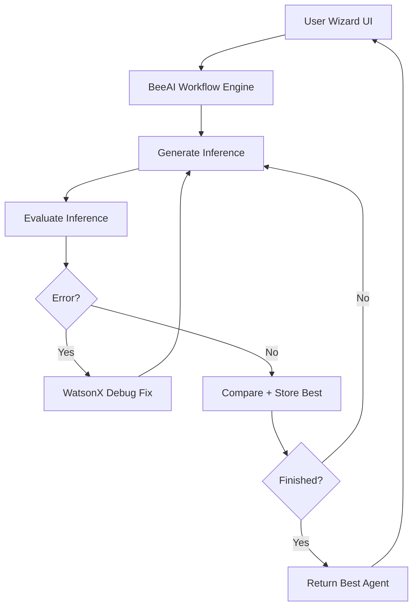

# 🧠 Iterative Inference Matcher with BeeAI Framework

Generalized Agent Generation through Multi-Round Inference and Evaluation using LLMs and BeeAI Workflows.

## 📌 Project Overview

This project implements a robust **Iterative Inference Matcher** using the **BeeAI framework**, enhanced with:

- Multi-step agent generation through iterative LLM inference
- Automatic evaluation and comparison logic
- Error recovery and auto-retry using WatsonX AI Debugger
- Streamlit-based frontend wizard for guided agent creation

It is designed to **generalize agent generation** across diverse infrastructure templates and supports automated testing, correction, and optimization of code via AI feedback loops.


## ⚙️ Features

✅ Iterative generation via BeeAI Workflows  
✅ Prompt Templates for flexible prompt engineering  
✅ Target-based evaluation scoring  
✅ Auto-error fixing and retry using WatsonX  
✅ Streamlit wizard UI to collect agent specs from users  
✅ Full modular Python backend with extensibility  

---

## 📁 Project Structure

```bash
.
├── src/
│   ├── workflows/
│   │   └── inference_matcher_workflow.py      # BeeAI workflow engine
│   ├── templates/
│   │   ├── inference_template.py              # Prompt template
│   │   └── agent_generation_template.py       # Specialized for agent configs
│   ├── evaluation/
│   │   └── evaluation_utils.py                # Custom scoring logic
│   ├── config/
│   │   └── targets.json                       # Target criteria definitions
│   ├── examples/
│   │   └── sample_document.txt                # Example input template
│   ├── debugger/
│   │   ├── debugger_app.py                    # Streamlit app for error fixing
│   │   └── utils.py                           # WatsonX integration logic
│   ├── frontend/
│   │   └── wizard_app.py                      # Web wizard for agent creation
│   └── tests/
│       ├── test_inference_workflow.py         # Workflow test cases
│       └── test_evaluation.py                 # Evaluation tests
├── .env                                       # API credentials (not committed)
├── requirements.txt
├── README.md
└── docs/
    └── documentation.md                               # Architecture & design report
```


## 🧪 Installation & Setup Guide

### ✅ 1. Clone the Repository

```bash
git clone https://github.com/ruslanmv/inference-matcher-beeai.git
cd inference-matcher-beeai
```

### ✅ 2. Create and Activate Virtual Environment

```bash
python -m venv venv
source venv/bin/activate    # macOS/Linux
venv\Scripts\activate       # Windows
```

### ✅ 3. Install Requirements

```bash
pip install -r requirements.txt
```

Make sure `beeai-framework`, `streamlit`, `pydantic`, `python-dotenv`, and `ibm-watson-machine-learning` are included.

### ✅ 4. Configure WatsonX

Create a `.env` file in root:

```
API_KEY=your_watsonx_api_key
PROJECT_ID=your_project_id
```


## 🚀 Running the Project

### 🌀 Run Inference Matcher (Backend)

```bash
python -m src.workflows.inference_matcher_workflow
```

Edit the `InferenceMatcherState` to customize:
- `document_template` → Text prompt
- `target_output` → Scoring goals from `config/targets.json`
- `search_parameters` → List of parameters to iterate
- `max_iterations` → Loop limit


### 🔁 WatsonX Auto Debug Assistant

Run via Streamlit:

```bash
streamlit run src/debugger/debugger_app.py
```

Paste buggy code → Auto suggestions → Logs corrections


### 🧙 Wizard UI for Agent Creation

Launch wizard with:

```bash
streamlit run src/frontend/wizard_app.py
```

Wizard will:
- Ask questions about the system
- Generate agent configs via BeeAI
- Return the best-matched inference


## 🧪 Run Tests

```bash
pytest src/tests/
```

Validates:
- Inference loop
- Score comparisons
- Error recovery paths


## 📌 Sample: `InferenceMatcherState`

```python
import json
import asyncio
from src.workflows.inference_matcher_workflow import inference_workflow, InferenceMatcherState

async def run():
    state = InferenceMatcherState(
        document_template=open("src/examples/sample_document.txt").read(),
        target_output=json.load(open("src/config/targets.json")),
        search_parameters=["version=1", "version=2", "version=3"],
        max_iterations=3
    )
    result = await inference_workflow.run(state)
    print("Best inference:", result.state.best_inference)

asyncio.run(run())
```


## 📚 Documentation

See technical breakdown in:

```
docs/PAPER.md
```

Covers:
- Prompt templates
- BeeAI workflow architecture
- Evaluation logic
- Debug strategy


## 🎯 Advanced Configuration

| Field               | Description                                  |
|--------------------|----------------------------------------------|
| `max_iterations`   | Number of inference attempts allowed         |
| `search_parameters`| Prompt variations or tuning inputs           |
| `target_output`    | Goal structure (metrics, fields)             |
| `output_format`    | Optional output mode: Python, YAML, JSON     |

---

## 🎨 Architecture Diagram




## 📌 Summary of Commands

| Task                         | Command                                      |
|------------------------------|----------------------------------------------|
| Clone repo                   | `git clone`                                  |
| Setup venv                   | `python -m venv venv`                        |
| Install deps                 | `pip install -r requirements.txt`           |
| Launch workflow              | `python -m src.workflows.inference_matcher_workflow` |
| Launch Streamlit debugger    | `streamlit run src/debugger/debugger_app.py` |
| Launch Streamlit wizard      | `streamlit run src/frontend/wizard_app.py`   |
| Run tests                    | `pytest src/tests/`                          |

---

## 🛠️ Future Roadmap

- Agent simulation/testing with auto-validation
- Embedding-based output evaluation
- Custom scoring tools for domain-specific agents
- One-click export of generated agents

---

## 🤝 Contributing

All contributions are welcome!

- 💡 Propose enhancements
- 🧪 Add test cases
- 📝 Improve documentation
- 🐛 Fix bugs and open issues

---

## 📜 License

Licensed under the [MIT License](LICENSE)