# 📘 Iterative Inference Matcher — Architecture & Design Documentation

---

## 🧠 Overview

The **Iterative Inference Matcher** is an AI-powered workflow system that automates the process of generating and evaluating agent configurations using prompt-based LLMs, with the BeeAI Framework as the core orchestration engine. The system iteratively generates candidate agents and compares them to target infrastructure criteria using custom similarity scoring logic.

---

## 📐 High-Level Architecture

```mermaid
graph TD
    A[🧑 User Input Wizard UI] --> B[📝 Document Template + Search Parameters]
    B --> C[🔄 Inference Matcher Workflow]
    C --> D1[🧩 Prompt Template Mustache]
    C --> D2[🤖 ChatModel LLM e.g. WatsonX]
    C --> D3[📊 Evaluation Logic Custom Python]
    C --> D4[🛠 Auto Error Debugger WatsonX]
    D3 --> E[🎯 Is Match Best?]
    E -->|Yes| F[✅ Store Best Inference]
    E -->|No| G[🔁 Next Iteration]
    F --> H[🖥 Output Result via UI]
```



---

## 🧱 Key Components

### 1. 🧭 BeeAI Workflow

- Defines a structured loop:
  - `generate_inference`
  - `evaluate_inference`
  - `compare_and_store`
  - `check_termination`

- Managed via `Workflow.SELF` transitions.
- Configured via `InferenceMatcherState` model.

---

### 2. 🧠 Prompt Templates

- Located in `src/templates/`
- Based on Mustache syntax
- Dynamically rendered with:
  - Document template
  - Search grid parameters
- Includes `inference_template.py` and `agent_generation_template.py`

---

### 3. 🤖 ChatModel Integration

- Abstracted through BeeAI’s backend
- Supports:
  - `ollama:granite3.1-dense:8b`
  - `watsonx:ibm/granite-3-8b-instruct`
- Prompts rendered and submitted
- Response parsed into raw inference strings or JSON objects

---

### 4. 📊 Evaluation Logic

- Custom utility: `calculate_similarity`
- Compares inference fields to targets
- Scores range from 0.0 to 1.0
- Targets loaded from `src/config/targets.json`
- Evaluation is modular and supports custom metric plugins

---

### 5. 🧰 Auto Error Debugger (WatsonX Assistant)

- Streamlit interface for debugging code
- Captures `stderr`, analyzes error, and resubmits fixed code
- Uses `utils.py` to call IBM WatsonX
- Retries up to `max_attempts` automatically

---

### 6. 🧪 Testing Modules

- `test_inference_workflow.py` verifies:
  - Iteration loop
  - Best score logic
- `test_evaluation.py` tests:
  - Partial match logic
  - Edge cases for empty input and mismatch

---

### 7. 💻 Frontend Wizard (Streamlit)

- Launched via `wizard_app.py`
- Collects:
  - Document template
  - Search grid values
  - Target JSON config
- Presents result with score and rendered agent code

---

## 🔄 Iterative Search Logic

Each round of the workflow performs:

1. Select next parameter from search grid
2. Render prompt using the template
3. Call LLM (ChatModel) to generate output
4. Evaluate output vs target using score function
5. If score improves best → store as best
6. Loop until max iterations or parameter list exhausted

---

## 🔒 Target Configuration (targets.json)

```json
{
  "target_description": "Valid agent for load-balanced backend.",
  "criteria": {
    "throughput": ">=1000 req/s",
    "max_latency": "<50ms",
    "protocols": ["TLS", "OAuth2"]
  }
}
```

---

## 🧠 Agent Generalization Logic

Prompt templates and search parameters are abstracted:

- Templates are reusable with any infrastructure specification
- Parameters can define:
  - Agent role
  - Version compatibility
  - Runtime environment

---

## 📈 Future Enhancements

- LLM-as-Judge for subjective scoring
- Vector embedding similarity scoring
- Workflow visualization
- Self-healing inference chain (memory-guided retries)
- CLI tool for batch evaluation

---

## 📚 Resources

- [BeeAI Framework Docs](https://beeai.dev)
- [WatsonX API Reference](https://cloud.ibm.com/docs/watsonx)
- [Streamlit Docs](https://docs.streamlit.io)

---

## 📦 Authors

- Project Lead: Ruslan Magana Vsevolodovna
- AI Workflow: BeeAI Team
- WatsonX Debug Integration: Ruslan Magana Vsevolodovna
- Frontend: Streamlit Contributors

