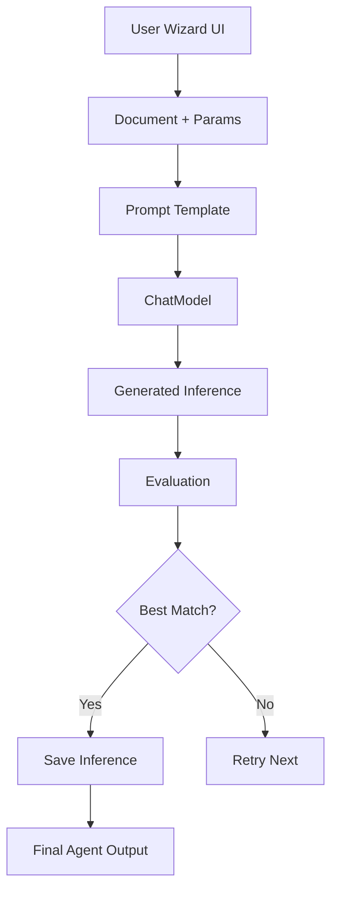

# 🧠 Building a RAG Agent using `inference-matcher-beeai`
We are interested to show how to create a simple agen by using a generalized agent builder powered by BeeAI workflows and WatsonX auto-debug assistant.

---

## 🔧 🧪 Installation & Setup Guide

### ✅ 1. Clone the Repository

```bash
git clone https://github.com/your-username/inference-matcher-beeai.git
cd inference-matcher-beeai
```

### ✅ 2. Create and Activate Virtual Environment

```bash
python -m venv venv
source venv/bin/activate      # macOS/Linux
venv\Scripts\activate         # Windows
```

### ✅ 3. Install Requirements

```bash
pip install -r requirements.txt
```

> Ensure you’ve also configured your `.env` file with WatsonX credentials if using debugger:

```
API_KEY=your_watsonx_api_key
PROJECT_ID=your_project_id
```

---

## 🎯 Goal: Build a RAG Agent That Answers IT Support Queries

---

## 📁 Dataset

The dataset is in: `data/rag_samples.csv`  
Each row contains:

| Column              | Description |
|---------------------|-------------|
| `ki_topic`          | Topic (e.g. email setup) |
| `ki_text`           | Full knowledge base content |
| `sample_question`   | A user query |
| `sample_ground_truth` | Expected answer |
| `sample_answer`     | AI-generated answer for eval |

---

## 🧼 Exercise 1 - Data Cleaning

You’ll need to write a preprocessing script:

```python
import re
import pandas as pd

def clean_text(text):
    text = re.sub(r'http\S+', '', text)                            # remove URLs
    text = re.sub(r'\b\w*\d\w*\b', '', text)                       # remove alphanumerics
    text = re.sub(r'#\S+', '', text)                               # remove hashtags
    text = re.sub(r'<.*?>', '', text)                              # remove HTML tags
    return text.strip()

df = pd.read_csv("data/rag_samples.csv")
df["cleaned_ki_text"] = df["ki_text"].apply(clean_text)
df.to_csv("data/rag_cleaned.csv", index=False)
```

---

## 🤖 Exercise 2 - Create the RAG Agent (via BeeAI Inference Matcher)

We'll use `inference-matcher-beeai` to generate custom agents that implement:

- Retrieval (document chunking & similarity search)
- Prompt + generation (answer generation based on context)

### 🪄 Step-by-Step with the UI (Streamlit Wizard)

1. Run the Web Wizard:

```bash
streamlit run src/frontend/wizard_app.py
```

2. In the UI:
   - 📝 Paste the cleaned document (`rag_cleaned.csv`) into the "📄 Document Template" field. You can use one or more rows as your initial knowledge base content.
   - 🔧 Add parameter variations like:
     ```
     use_embedding=True
     retriever_method=cosine
     model=watsonx/granite-8b
     ```
   - 🎯 Paste a sample target config:

```json
{
  "target_description": "Agent should generate accurate support answers using RAG.",
  "criteria": {
    "context_usage": "true",
    "conciseness": "high",
    "retrieval_citation": "true"
  }
}
```

3. Select 3–5 iterations and click **"🚀 Generate Agent"**.

4. The wizard:
   - Iterates over prompt + parameter variations
   - Evaluates each with scoring logic
   - Suggests the best agent config (shown as final code or instructions)

---

## 🕵️ Exercise 3 - Agent for Research & Hallucination Detection

You can use `agent_generation_template.py` to generate an agent with structured reasoning like:

```mustache
You are a research agent.
Step 1: Search for factual answers using trusted sites.
Step 2: Extract sources and validate consistency.
Step 3: Respond with structured output:
- Answer
- Source 1
- Source 2
- Confidence
```

Use the wizard UI again, with the above prompt structure and sample config.

---

## 📊 Exercise 4 - Evaluation

Once you generate answers using the agent:

### ROUGE/BLEU Evaluation (via NLTK or `rouge_score`):

```bash
pip install rouge-score nltk
```

Example:

```python
from rouge_score import rouge_scorer
scorer = rouge_scorer.RougeScorer(['rougeL'], use_stemmer=True)

for i, row in df.iterrows():
    score = scorer.score(row["sample_ground_truth"], row["sample_answer"])
    print(f"ROUGE-L for row {i}:", score["rougeL"].fmeasure)
```

### Custom Metric

Add relevance scoring to `evaluation_utils.py`:

```python
def relevance_score(generated, expected):
    from difflib import SequenceMatcher
    return SequenceMatcher(None, generated.lower(), expected.lower()).ratio()
```

---

## 🧠 How It Works Under the Hood (Diagram)



---

## ✅ Summary

| Task                      | Command |
|---------------------------|---------|
| Setup project             | ✅ See install guide |
| Launch wizard UI          | `streamlit run src/frontend/wizard_app.py` |
| Clean dataset             | Use provided cleaner |
| Run inference matcher     | In UI |
| Evaluate answers          | `rouge_score`, custom function |
| Debug failing code        | `streamlit run src/debugger/debugger_app.py` |

---

## 🚀 Next Steps

- Add chunking + embedding-based retriever (e.g. FAISS)
- Plug in Langchain for modular RAG chains
- Use WatsonX `llama-2-70b` for final inference

